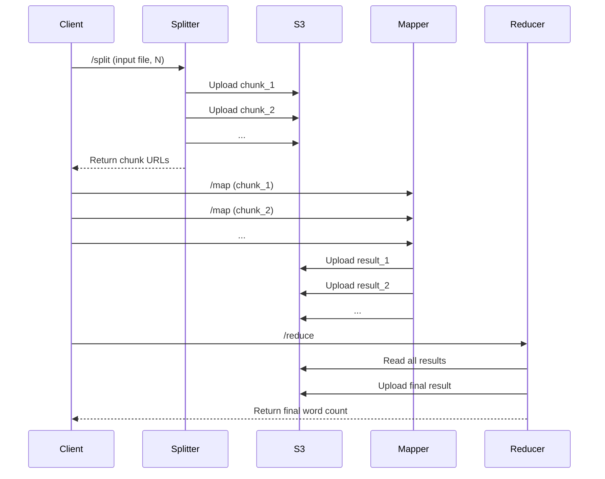

# Homework4
## Part 1: Reading
### Most Informative
The most enlightening concept was how RPC extends local procedure calling to distributed environments:  
"It is a powerful technique based on extending the notion of local procedure calling, so that the called procedure may not exist in the same address space as the calling procedure."  
This abstraction makes distributed computing feel familiar while hiding the complexity underneath.
### What you were already experienced with, and where you got that experience!
TCP and UDP protocal knowledge, I learn it from the Network course.
## Part 2: Infrastructure setup
### Task running
  

### Service connected

### EC2 vs. ECS
EC2 is a system allowing customers to manage virtual machines. ECS is a service to manage containers.
### VPC & Subnet
VPC is a kind of virtual network implementation, enabling users to launch AWS resources in a private virtual network. A subnet is a range of IP addresses within your VPC. It's a way to partition your VPC's IP address space.
### TCP vs. UDP
TCP guarantees the packets to be sent to the receiver by 3-way handshaking, ACK, retransimission.  
**However**, modern web applications are prone to use UDP by introducing QUIC to take advantages of TCP, such as HTTP/3.

## Part 3: Word Counting using MapReduce
### System Architecture
The distributed MapReduce system consists of 3 main microservices and a management client:

- **Splitter Service (Go/Gin):** Splits the input file into N chunks and uploads them to S3. The service returns chunk file urls.
- **Mapper Service (Go/Gin):** Processes each chunk from S3, counts word occurrences, and writes intermediate results back to S3. There are totally maximum 6 mappers running concurrently.
- **Reducer Service (Go/Gin):** Aggregates all mapper outputs from S3, sums word counts, and produces the final result.
- **Management Client (Python):** Coordinates the workflow by making async HTTP calls to splitter, mapper, and reducer endpoints, handling chunk distribution and result aggregation.

### Workflow
1. **Splitting:** The client sends a request to the splitter service with the input file and desired chunk count. The splitter uploads chunk files to S3.
2. **Mapping:** The client triggers the mapper service for each chunk. Each mapper reads its chunk from S3, counts words, and writes results to S3.
3. **Reducing:** The client calls the reducer service, which reads all mapper outputs from S3, aggregates word counts, and returns the final result.

### Workflow Figure (Mermaid Sequence Diagram)

### API Endpoints
- `/split`: POST input file and chunk count, returns chunk info
- `/map`: POST chunk ID, triggers word count for that chunk
- `/reduce`: POST request, aggregates all mapper results

### Infrastructure
- **AWS ECR:** Stores Docker images for the services
- **AWS ECS:** Hosts the splitter, mapper, and reducer services as containers
- **AWS S3:** Stores input files, chunk files, and intermediate/final results

### Performance Testing
I tested the performance of the MapReduce system using the given text file (164K) and a larger text file (20MB) and varied the number of mappers from 1 to 6. The results are as follows:

For the 164K text file, there are no deterministic performance improvements by increasing the number of mappers. This is likely because the bottleneck is not in the computation but in the overhead of managing multiple mappers and network I/O with S3.

For the 20MB text file, increasing the number of mappers from 1 to 6 shows a clear performance improvement, reducing the total duration. Besides, the duration decreases more significantly when increasing mappers from 1 to 2, while the improvement from 3 to 6 mappers is less pronounced. This suggests diminishing returns as the number of mappers increases, likely due to overhead and resource contention.

**What happen if one of the mapper failed? How would you recover?**
Current system does not handle mapper failures, if 1 mapper fails, it will not proceed to the reduce phase. To recover, the client could implement retry logic or re-arrange the task to another available mapper.

**How can you scale this system into 10 or 100 mappers?**
It costs too much to use many ECS tasks. If we have more mappers, we can manage them using a queue system. The client can push chunk processing tasks into the queue, and mappers can pull tasks from the queue when they are available. This way, we can scale the number of mappers dynamically based on the workload.

**What was the challenging part of coordinating tasks manually?**
The most challenging part is lack of available ECS tasks status and capabilities. I can only assume any mapper can handle any chunk. This can lead to inefficiencies and potential bottlenecks if certain mappers are overloaded while others are underutilized. I encountered issues while testing with a 50MB file, as the ECS tasks were not sufficient to handle the load, leading to failures in processing all chunks.
