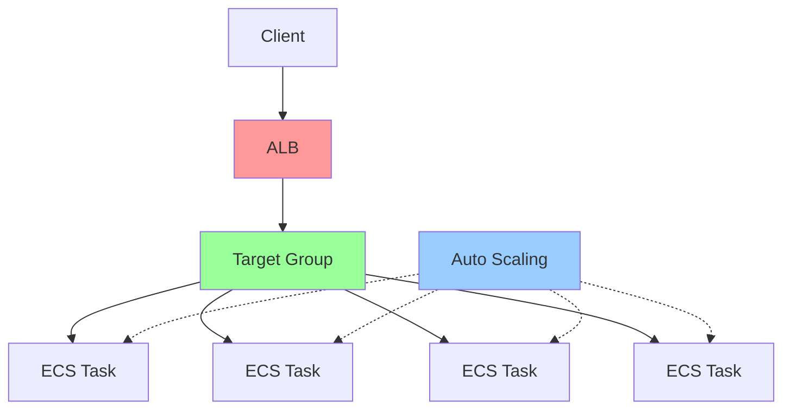

# Homework 6
## Search API single node performance
### Baseline 5 users - 2 min


### Breaking Point 20 users - 3 min


With load increasing, both CPU and memory utilization increase.
| Metric | 5 Users | 20 Users |
|--------|---------|----------|
| RPS    |  142    |  500  |
| **CPU Utilization** | 14% | 44% |
| **Memory Utilization** | 17% | 10% |
| 50% response time (ms) | 32 | 35 |
| 95% response time (ms) | 50 | 80 |

**Key Observations:**
- Memory usage remains stable
- CPU becomes the primary bottleneck
 
Increase CPU allocation from 256 → 512 CPU units to handle higher load.


Switching to 512v CPU and 1G memory and keeping test with 20 users:
| Metric (20 users) | 256v CPU | 512v CPU |
|--------|---------| -------- |
| **CPU Utilization** | 44% | 23% |
| 50% response time (ms) | 35 | 40 |
| 95% response time (ms) | 80 | 80 |

## Horizontal Scaling Infrastructure
### Architecture with ALB


### Core Functions
#### ALB
```tf
resource "aws_lb" "this" {
  name               = "${var.service_name}-alb"
  internal           = false
  load_balancer_type = "application"

resource "aws_lb_target_group" "this" {
  ***
  health_check {
    enabled             = true
    healthy_threshold   = 2
    interval            = 30
    matcher             = "200"
    path                = var.health_check_path
    port                = "traffic-port"
    protocol            = "HTTP"
    timeout             = 5
    unhealthy_threshold = 2
  }
```

### Auto Scaling
```tf
variable "min_capacity" {
  type        = number
  default     = 2
  description = "Minimum number of ECS tasks"
}

variable "max_capacity" {
  type        = number
  default     = 4
  description = "Maximum number of ECS tasks"
}

variable "target_cpu_utilization" {
  type        = number
  default     = 70
  description = "Target CPU utilization percentage for auto scaling"
}

variable "health_check_path" {
  type        = string
  default     = "/health"
  description = "Health check path for ALB"
}
```


### Applying 20 users


### Upgrading to 100 users


### Upgrading to 400 users


#### Performance Test Results Comparison
| Users | Task Count | CPU Usage (%) | Memory Usage (%) | RPS | 50% Response Time (ms) | 95% Response Time (ms) |
|-------|------------|---------------|------------------|-----|------------------------|------------------------|
| 20    | 2          | 20            | 10               | 300 | 50                     | 100                    |
| 60    | 2          | 35            | 10               | 500 | 100                   | 200                    |
| 80    | 4          | 75            | 18               | 34  | 47                     | 340                    |

### Key Observations
**Auto-Scaling is Responsive**  
- CPU-based scaling (70% threshold) triggers appropriately
- New instances come online before system failure
- Load rebalancing happens automatically
**Performance Improves with Scale**
- 95th percentile response times improve: 440ms → 430ms → 340ms
- This demonstrates the power of distributing load across multiple instances

## Resilience Test


### Key Observation
The system had self-healing mechanism, auto detecting "unhealthy", then created a new task, maintaining healthy status.

## Exploration
### 90 default CPU utilization


### 50 default CPU utilization


| Description | Task Count | CPU Usage (%) | Memory Usage (%) | RPS | 50% Response Time (ms) | 95% Response Time (ms) |
|-------------|------------|---------------|------------------|-----|------------------------|------------------------|
| 90 CPU      | 3          | 100           | 18               | 30  | 150                    | 980                    |
| 50 CPU      | 6          | 50            | 11               | 35  | 41                     | 200                    |

### Stop multiple instances


Stopped 3 instances, then the service recovered to 6 instances. Found a jitter on Locust test and CPU utilization as well.

### Stop all instances


Stopped all instances, then the service recoverd to 6 instances. Found some failed requests on Locust tests.

## Result:
### How the system solved your Part II bottleneck
**Part II bottleneck**
- **Resource exhaustion**: CPU/memory limits on single instance
- **No fault tolerance**: Instance failure = whole service down
- **No load distribution**: Single point handles all concurrent requests

**Part III Solution**
- **Redundancy**  
Load balancer provides multiple paths to service
- **Load Distribution**  
ALB distributes requests across healthy instances preventing any single instance from becoming bottleneck
- **Elastic Scaling**  
Auto Scaling automatically adds capacity when needed
CPU-based scaling prevents problems from overload such as increasing request latency
- **Fault Isolation**  
Individual instance failures don't cascade to system failure
Failed instances automatically replaced without manual intervention

### The role of each component
**ALB**: Traffic dispatcher
**Target Group**: Instance manager and health monitor
**Auto Scaling**: Monitor performance and manage instance

### Advantages of Horizontal scalling
1. **Fault Tolerance**
2. **Cost Efficiency**, scalling up and down according to the requirement, does not waste resource.
3. **Load Distribution**, prevants single instance performance bottleneck, such as CPU core, network I/O.


