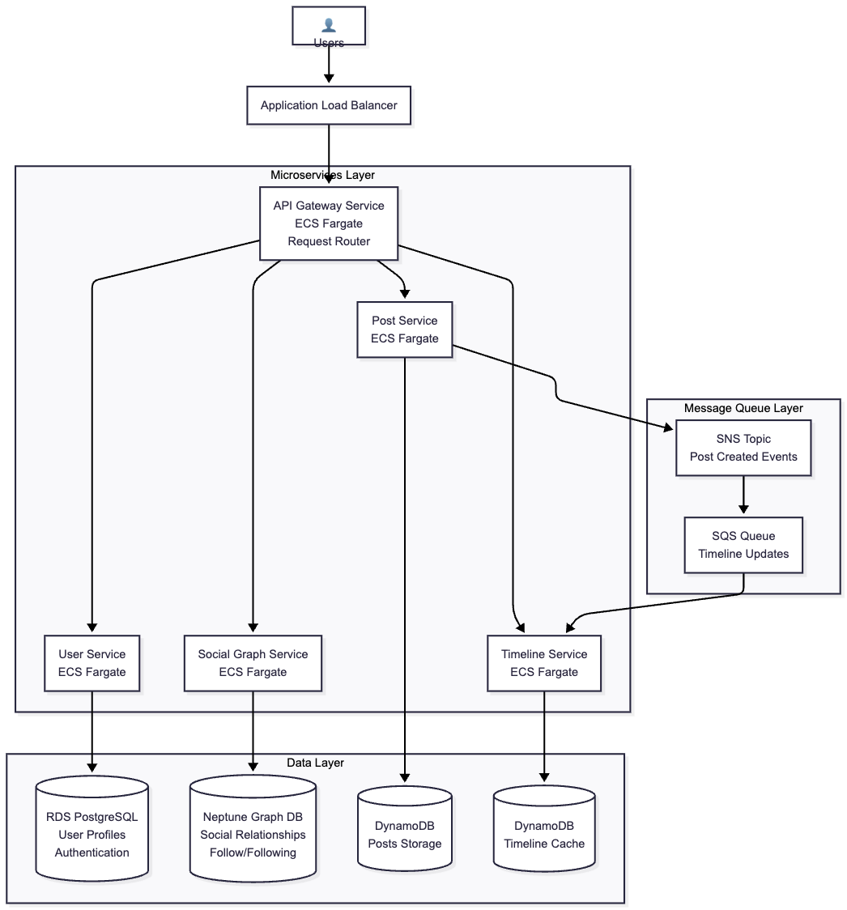

# Detailed Project Plan: Distributed Social Media Platform

## 1. Executive Summary

**Project Goal**: Design and implement a distributed social media platform demonstrating core distributed systems concepts including fan-out algorithms, CAP theorem trade-offs, and horizontal scaling strategies.

**Architecture Overview**: 4-microservice system (User, Post, Social Graph, Timeline Services) deployed on AWS ECS Fargate with Infrastructure as Code using Terraform.

**Key Deliverables**: 
- Post and Timeline generation with 3 fan-out strategies (Push, Pull, Hybrid)
- Performance analysis across different user scales
- Comprehensive scalability testing and CAP theorem validation

## 2. Technical Architecture

### 2.1 System Design 

### 2.2 Fan-out Strategy Implementation

- **Push Model**: Pre-compute timelines for all followers upon post creation
- **Pull Model**: Generate timelines on-demand during read requests
- **Hybrid Model**: Celebrity users (50K+ followers) use pull strategy, regular users use push strategy

### 2.3 Service Responsibilities

| Service | Responsibilities | Database | Key Features |
|---------|------------------|----------|--------------|
| User Service | profile management | PostgreSQL | User registration, profile data |
| Post Service | Content creation | DynamoDB | Create Post |
| Social Graph Service | Relationship management | Neptune | Follow/unfollow, follower lists |
| Timeline Service | Timeline generation/retrieval | DynamoDB | Fan-out algorithms, timeline caching |

## 3. Implementation Phases

### Phase 1: Core Infrastructure Setup + Core Service Development (Week 1-2)

**Objectives:**
- Establish AWS ECS Fargate environment
- Configure Terraform Infrastructure as Code
- Set up basic Go/Gin microservice framework
- Initialize database instances (PostgreSQL, DynamoDB)
- Implement fundamental CRUD operations for each service
- Establish inter-service communication patterns
- Create basic API endpoints

**Deliverables:**
- [ ] Terraform scripts for AWS infrastructure
- [ ] Basic Go/Gin service templates
- [ ] Database schemas and connections
- [ ] Docker containerization with multi-arch support
- [ ] AWS Service Connect configuration
- [ ] **User Service**: Registration, profile management APIs
- [ ] **Post Service**: Create, post functionality
- [ ] **Social Graph Service**: Follow/unfollow relationship management
- [ ] **Timeline Service**: Basic timeline retrieval infrastructure
- [ ] RPC interface definitions using protobuf
- [ ] SNS/SQS configuration

### Phase 3: Fan-out Algorithm Implementation (Week 3)

**Objectives:**
- Implement 3 distinct fan-out strategies
- Optimize for different user scenarios

**Deliverables:**
- [ ] **Push Fan-out**: Pre-computed timeline updates
- [ ] **Pull Fan-out**: On-demand timeline generation
- [ ] **Hybrid Fan-out**: Celebrity detection (50K+ followers threshold)

### Phase 4: Performance Testing & Analysis (Week 4)

**Objectives:**
- Comprehensive load testing across different scales
- Performance comparison between 3 fan-out strategies

**Deliverables:**
- [ ] Locust load testing configuration
- [ ] Performance metrics for 5K, 25K, 100K user scenarios
- [ ] Latency, throughput, and resource utilization analysis
- [ ] Horizontal scaling verification

## 4. Technology Stack

### Backend Services
- **Programming Language**: Go
- **Web Framework**: Gin
- **Communication**: RPC with protobuf message definitions

### Data Storage
- **User Data**: PostgreSQL
- **Relationship**: Neptune
- **Posts & Timelines**: DynamoDB (NoSQL for scalability)
- **Caching**: Redis ElastiCache (optional, time permitting)

### Infrastructure & Deployment
- **Container Platform**: AWS ECS Fargate
- **Load Balancing**: Application Load Balancer
- **Service Discovery**: AWS Service Connect
- **Infrastructure as Code**: Terraform
- **Container Registry**: Amazon ECR
- **Monitoring**: AWS CloudWatch

### Development & Testing
- **Load Testing**: Locust
- **Version Control**: GitHub with Kanban project management. [[https://github.com/users/PCBZ/projects/4]]
- **Containerization**: Docker with ARM64/AMD64 support

## 5. Core Experiments

We will tests with 3 user scales： 5K, 25K, 100K. User distribution:  

Attribute | Regular Users | Influencers | Celebrities
-- | -- | -- | --
Percentage | 85% | 14% | 1%
Follower Count | 10-100 | 100-50,000 | 50,000-500,000
Following Count | 50-200 | 100-500 | 50-200

### 5.1 Push Fan-out Model

**Objective**: Evaluate pre-computed timeline performance
**Implementation**: 
- Timeline updates pushed to all followers upon post creation
- Timeline reads require zero additional computation
**Test Scenarios**: 5K, 25K, 100K users
**Key Metrics**: 
- Write latency (post creation time)
- Read latency (timeline retrieval)
- Storage requirements per user
- System throughput

### 5.2 Pull Fan-out Model
**Objective**: Evaluate on-demand timeline generation performance
**Implementation**:
- Timeline generated dynamically when user requests it
- Requires aggregation of posts from all followed users
**Test Scenarios**: 5K, 25K, 100K users  
**Key Metrics**:
- Read latency (timeline generation time)
- Write latency (post creation time)
- CPU utilization during reads
- Database query complexity

### 5.3 Hybird Fan-out Model
**Objective**: Evaluate combined approach with celebrity threshold
**Implementation**:
- Regular users (<50K followers): Push model
- Celebrity users (≥50K followers): Pull model
- Dynamic switching based on follower count
**Test Scenarios**: 5K, 25K, 100K users
**Key Metrics**:
- Mixed read/write latency
- Resource optimization
- Algorithm switching overhead
- Overall system efficiency