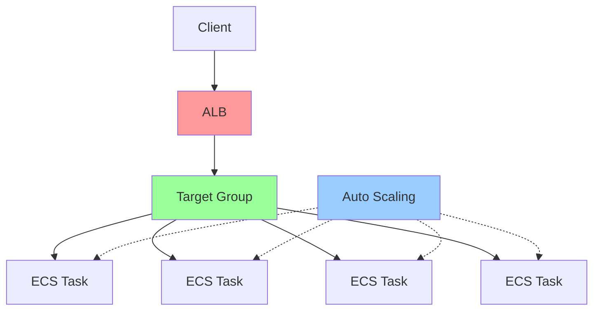

# Final Mastery 2

## Overview / Features

This project implements a small but complete microservice platform for product search and order processing. It includes the application code, containerization, infrastructure-as-code, and load-testing tooling so you can validate both functional behavior and scalability.

Key features:

- Product Search API (`GET /v1/products/search`) — search a generated product catalog by query term.
- Order Processing API (`POST /v1/orders/sync`, `GET /v1/orders/stats`) — ingest orders and report aggregated statistics.
- Docker multi-stage build for producing small production images.
- Terraform modules to provision networking, ALB, ECS tasks, ECR and autoscaling (works with LocalStack for local simulation).
- LocalStack-based integration testing and Terraform smoke tests for CI-friendly validation.
- Load testing scripts (Locust) to validate throughput, latency and autoscaling behavior.

## Repo information
- Repository path: `final_mastery2_3` (local)
- Project: Order Processing & Product Search microservice (Go / Gin)
- Key technologies: Go (Gin), Docker, Terraform, LocalStack (Pro), ECS (Fargate model), ALB, CloudWatch (simulated), Locust for load testing

Project URL: https://github.com/PCBZ/CS6650/edit/main/final_mastery2_3

---

## Architecture
Below is an architecture diagram


---

## Deployment environments and when to use each
### LocalStack vs. AWS Configuration
| Configuration Aspect | AWS Deployment | LocalStack Deployment |
|---------------------|----------------|----------------------|
| **Provider Credentials** | Real AWS access keys and secrets | Dummy credentials (`"test"` values) |
| **Service Endpoints** | Default AWS regional endpoints | All services point to `localhost:4566` |
| **ECR Registry Address** | AWS account-specific ECR URLs | LocalStack simulated ECR endpoints |
| **Authentication** | AWS IAM-based authentication | Mock authentication with test credentials |
| **IAM Roles** | Production IAM roles and policies | Locally created/simulated IAM resources |
| **Monitoring** | CloudWatch integration available | Limited/simulated monitoring capabilities |

**For example:**

Create a local role instead of using existed `LabRole` for LocalStack deployment.

```terraform
resource "aws_iam_role" "ecs_execution_role" {
  name = "${var.service_name}-execution-role"

  assume_role_policy = jsonencode({
    Version = "2012-10-17"
    Statement = [
      {
        Effect = "Allow"
        Principal = {
          Service = "ecs-tasks.amazonaws.com"
        }
        Action = "sts:AssumeRole"
      }
    ]
  })
}
```

---

## Metrics (RPS & Response Time)
Testing search API

### RPS & Response time

**AWS Deployment**
| Users | Task Count | CPU Usage (%) | Memory Usage (%) | RPS | 50% Response Time (ms) | 95% Response Time (ms) |
|-------|------------|---------------|------------------|-----|------------------------|------------------------|
| 20    | 2          | 60            | 10               | 120 | 150                    | 300                    |
| 40    | 3          | 45            | 10               | 130 | 260                    | 470                    |
| 60    | 4          | 98            | 12               | 500 | 80                     | 320                    |

**LocalStack Deployment**
| Users | Task Count | CPU Usage (%) | Memory Usage (%) | RPS | 50% Response Time (ms) | 95% Response Time (ms) |
|-------|------------|---------------|------------------|-----|------------------------|------------------------|
| 20    | 2          |               |                  | 320 | 60                     | 100                    |
| 40    | 2          |               |                  | 310 | 130                    | 210                    |
| 60    | 2          |               |                  | 310 | 180                    | 310                    |


### Deploy Duration


---

## When it is best to deploy
### LocalStack Environment

Best for Development & Testing

Use LocalStack when:
- Feature development: 30-second deployments vs 5+ minutes on AWS
- Cost optimization: $0 infrastructure vs $400+/month AWS costs
- Team development: Consistent environment for all developers
- CI/CD testing: Validate infrastructure without cloud expenses

Performance: Handles 300 RPS consistently, 60ms response time at low load

### AWS Environment

Best for Production & Scale

Use AWS when:

- Live traffic: Serving real users with SLA requirements
- Auto-scaling needed: Scales from 130 to 500 RPS automatically
- Enterprise features: CloudWatch monitoring, security compliance
- High availability: Multi-AZ deployment and disaster recovery


