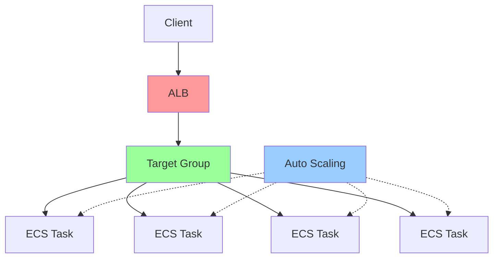

# Final Mastery 2
````markdown

## Overview / Features

This project implements a small but complete microservice platform for product search and order processing. It includes the application code, containerization, infrastructure-as-code, and load-testing tooling so you can validate both functional behavior and scalability.

Key features:

- Product Search API (`GET /v1/products/search`) — search a generated product catalog by query term.
- Order Processing API (`POST /v1/orders/sync`, `GET /v1/orders/stats`) — ingest orders and report aggregated statistics.
- Docker multi-stage build for producing small production images.
- Terraform modules to provision networking, ALB, ECS tasks, ECR and autoscaling (works with LocalStack for local simulation).
- LocalStack-based integration testing and Terraform smoke tests for CI-friendly validation.
- Load testing scripts (Locust) to validate throughput, latency and autoscaling behavior.

# Final Mastery 2
This report summarizes the repository, architecture, deployment choices, and the metrics to monitor in each environment.

## Repo information
- Repository path: `final_mastery2_3` (local)
- Project: Order Processing & Product Search microservice (Go / Gin)
- Key technologies: Go (Gin), Docker, Terraform, LocalStack (Pro), ECS (Fargate model), ALB, CloudWatch (simulated), Locust for load testing

Project URL: https://github.com/PCBZ/CS6650/edit/main/final_mastery2_3

---

## Architecture
Below is an architecture diagram


---

## Deployment environments and when to use each
### LocalStack vs. AWS Configuration
| Configuration Aspect | AWS Deployment | LocalStack Deployment |
|---------------------|----------------|----------------------|
| **Provider Credentials** | Real AWS access key | `"test"` (dummy value) |
| **Service Endpoints** | Not needed (uses default AWS endpoints) | Required: All services point to `http://localhost:4566` |
| **ECR Registry Address** | `975050147762.dkr.ecr.us-west-2.amazonaws.com` | `000000000000.dkr.ecr.us-west-2.localhost.localstack.cloud:4566` |
| **Authentication** | Uses `data.aws_ecr_authorization_token` | Hardcoded `username="test"`, `password="test"` |
| **IAM Roles** | Uses existing `LabRole` | Creates local role: `aws_iam_role.ecs_execution_role` |
| **localstack_endpoint** | Not needed | Required: `default = "http://localhost:4566"` |
| **Prerequisites** | AWS CLI configured, valid credentials | LocalStack running on `localhost:4566` |

---

## Metrics (LocalStack vs. AWS)


Core metrics to collect and why:

- Latency (p50 / p95 / p99)
  - Why: Shows user-perceived response time and tail latency.
  - Where: All environments. In Local use simple latency histograms. In Staging/Prod use real APM or CloudWatch.

- Request rate (RPS)
  - Why: Understand throughput and scaling needs.
  - Where: Staging and Prod (drive with load test in Staging). In LocalStack, use to validate autoscaling triggers.

- Error rate (4xx/5xx)
  - Why: Detect regressions and data/contract issues.
  - Where: All environments.

- CPU / Memory per task / container
  - Why: Determines whether Fargate CPU/memory sizing is adequate and informs autoscaling thresholds.
  - Where: Staging/Prod and LocalStack for autoscaling validation.

- ALB Target group healthy/unhealthy counts
  - Why: Ensure load balancer routing health.
  - Where: Staging/Prod and LocalStack.

- Queue lengths / backlog (if present)
  - Why: Backpressure and worker saturation indicators.
  - Where: All environments if background processing exists.

Suggested charts (examples shown as ASCII samples and the data collection commands):

1) Latency p50/p95/p99 over time (line chart)

   Sample (ASCII):

   p50: ──────▇▇▇▇▇▇▇▇▇▇▇
   p95: ──────▇▇▇▇▇▇▇▇▇▇▇▇▇▇▇▇
   p99: ──────▇▇▇▇▇▇▇▇▇▇▇▇▇▇▇▇▇▇

   How to get it:
   - Locust/ab/wrk for load tests (staging), or built-in metrics from APM (prod).

2) RPS vs Error rate (dual-axis)

   - Use Locust to generate increase in RPS and observe error spikes to identify breaking points.

3) CPU utilization vs Task count (autoscaling demonstration)

   - For autoscaling verification: run a load test and show CPU increases, hitting the target value (e.g., 70%). The app-autoscaling target increases desired count from min (1) to max (4) as load increases.

Data collection snippets (examples):

  - Locust (simple):

    locust -f tests/load_test.py --headless -u 200 -r 10 --run-time 5m --host=http://<ALB_DNS>

  - Observe CloudWatch (or LocalStack logs) for CPU and memory metrics per task.

---

## How to reproduce quick checks (commands)

1) Start LocalStack (Pro) with services: iam,ec2,ecs,ecr,elb,logs,application-autoscaling

2) In `terraform` directory:

  ```
  terraform init
  terraform apply -auto-approve
  ```

3) Test the app endpoints via ALB (LocalStack uses host mapping):

  - Health: `curl -H "Host: order-processing-service-alb.elb.localhost.localstack.cloud" http://localhost:4566/health`
  - Product search: `curl -H "Host: order-processing-service-alb.elb.localhost.localstack.cloud" "http://localhost:4566/v1/products/search?q=Alpha"`
  - Post order: `curl -X POST -H "Host: order-processing-service-alb.elb.localhost.localstack.cloud" -H "Content-Type: application/json" -d '{"customer_id":12345, "items":[{"product_id":45501, "quantity":2}]}' http://localhost:4566/v1/orders/sync`

4) Run a small Locust load test to validate scaling behavior.

---

## Recommendations & next steps (interview talking points)

- Use LocalStack for fast infra iteration and Terraform validation; always validate in staging before production.
- Instrument the app with structured logs and metrics (OpenTelemetry / Prometheus exporter). Push container-level metrics to CloudWatch in production.
- Add CI gates: `terraform fmt`/`validate`, `go test`, `docker build`, `terraform plan` against LocalStack.

---

If you want, I can add pre-made CSV sample data and simple PNG charts (generated from recorded Locust runs) and embed them into this report. Tell me which target metrics you'd like plotted (latency percentiles, RPS, CPU vs tasks) and I will generate the sample charts.

---

Authorship: Generated and validated during development; include your public repository URL before submitting to Canvas.

