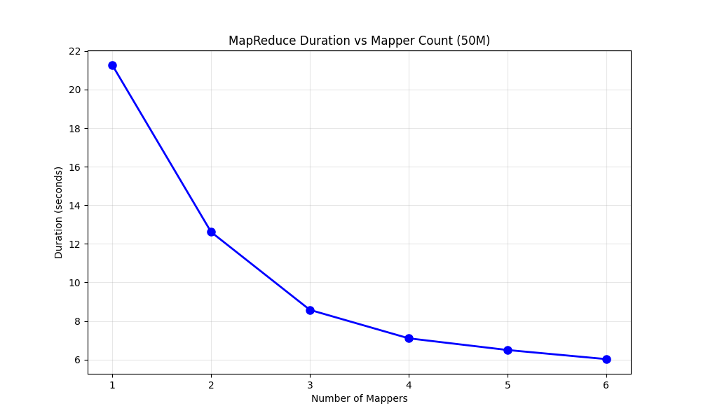

# What have enjoyed learning so far?

## CAP Theorem Explains Master-Slave Read Inconsistency
### The Master-Slave Consistency Problem
In my earlier implementation, I had a read inconsistency issue:
When a user updated data (click a like in a post) then immediately read it back, sometimes they got stale data from a slave replica instead of the updated data from the master.
### CAP Theorem Explains Why
CAP theorem shows this inconsistency is inevitable in master-slave replication:
If using async replication, it only guarantees availability and partition tolerance, but not consistency.
### The Key Insight
The consistency problem reported by users wasn't a bug—it was the fundamental trade-off of choosing availability and partition tolerance over strong consistency. CAP theorem explains that you can't have all three, so master-slave systems inherently have consistency windows where replicas diverge.

## MapReduce: From Paper to Practice
### Understanding the Paper
The MapReduce paper was a revelation in understanding how to process massive datasets across distributed systems. What struck me most was how the paper abstracts away the complexities of distributed computing—fault tolerance, data distribution, load balancing—behind a simple programming model inspired by functional programming.
### My ECS Implementation Experience
Building my MapReduce implementation with up to 6 ECS tasks provided concrete insights into horizontal scaling. Testing with configurations from 1 to 6 instances demonstrated how MapReduce's parallelism translates to real performance improvements.

  

## Auto-Scaling in Product-API
### The Simple Setup
My Product-API used ECS Auto Scaling with these settings:
CPU threshold: 70%
Scale range: 2-4 instances
Load balancer: Distributed requests across tasks
### How This Connects to Theory
CAP Theorem in Action: My auto-scaling system chose Availability + Partition tolerance:
- System stayed up during scaling events
- Individual task failures didn't break the whole system
- Load balancer routed around unhealthy instances

Horizontal Scaling Validation: Just like in MapReduce (1-6 tasks), adding more ECS instances improved performance by distributing load—proving the theoretical benefits of horizontal scaling.
### Key Insight
Auto-scaling demonstrates core distributed systems principles: when demand increases, add more nodes rather than trying to make one node faster. The system automatically implements the horizontal scaling strategies we study in theory, making it resilient and performant without manual intervention.
